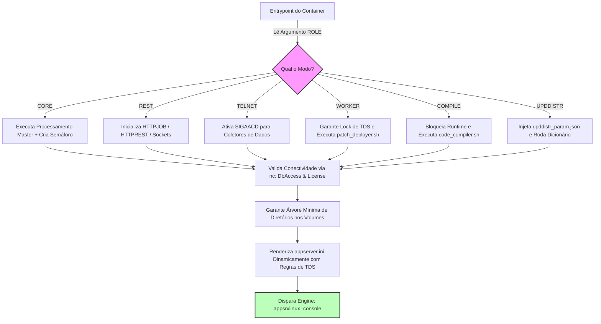

# 🐳 TOTVS Protheus - Application Server 64-bits (Fábriga CI/CD)

Este repositório é um componente isolado da arquitetura TOTVS Protheus Modern DevOps [https://github.com/rodrigomicrosiga-devops/totvs-protheus-modern-devops], e isola e automatiza a esteira de build do **TOTVS AppServer** na organização **`rodrigomicrosiga-devops`**. Ele encapsula uma inteligência de orquestração multi-papel capaz de instanciar nós especialistas variando apenas a herança de argumentos em runtime.

---

## 🏗️ Arquitetura Operacional Dinâmica (Multi-Role Engine)

O container foi projetado sob o princípio da imutabilidade de infraestrutura: a mesma imagem gerada pelo pipeline assume diferentes comportamentos lógicos e perfis de segurança de acordo com a `ROLE` definida no provisionamento do ecossistema.



### ⚙️ Especificações Técnicas e Governança

* **Imagem Base**: Ubuntu 22.04 LTS com injeção de dependências de hardware (`dmidecode`) e libs nativas (`libtinfo5, netcat-openbsd`).

* **Regras de Escopo de TDS**: Bloqueio rígido automático de aplicação de patches, desconexão de usuários e monitoramento nos nós de produção (`core`, `rest`, `telnet`), liberando modificações estruturais estritamente nos ambientes controlados de `pipeline` (`worker`, `compile`).

* **Bootstrap Isolado de Cargas**: Gerenciamento nativo e extração unificada via unzip dos arquivos cruciais de dicionário (`fiscal.zip`, `menus.zip`, `dicionarios.zip`) protegidos contra re-extrações destrutivas pós-first-boot.

### 🏷️ Rastreabilidade de Build

A tag da imagem publicada permanece fixa entre builds — só muda em uma nova release de versão. Para rastrear qual commit gerou um build específico sem depender da tag, o `pipeline` grava o label `org.opencontainers.image.revision` com o SHA do commit em toda imagem publicada:

```bash
docker inspect --format '{{ index .Config.Labels "org.opencontainers.image.revision" }}' rodrigomicrosiga/appserver-dev:24.3.1.5
```

### 🚀 Como Executar a Imagem

A imagem exige a passagem do papel especialista como argumento de execução padrão:

```bash
# Executando um nó de processamento REST puro acoplado ao arquivo de credenciais
docker run -d --name protheus-rest --env-file .env.appserver rodrigomicrosiga/appserver-dev:24.3.1.5 rest
```